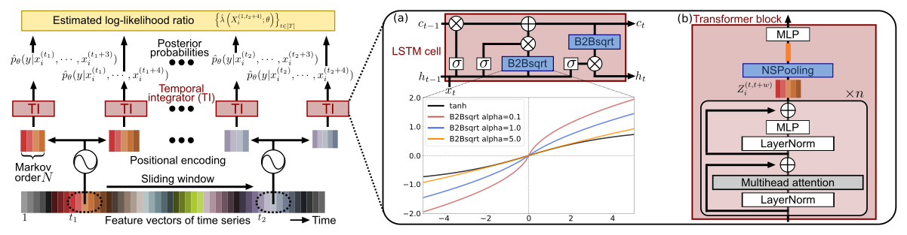

# LLR saturation problem

This is an official repository of the paper, _Toward Asymptotic Optimality: Sequential Unsupervised Regression of Density Ratio for Early Classification_. Tensorflow implementations of the two proposed models, __B2Bsqrt-TANDEM__ and __TANDEMformer__, are in the repo. We also list the detailed experimental setups that is used to generate the results.  

## Introduction
Conventional Sequential density ratio estimation (SDRE) algorithms can fail to estimate DRs precisely due to the internal overnormalization problem, which prevents the DR-based sequential algorithm, Sequential Probability Ratio Test (SPRT), from reaching its asymptotic Bayes optimality. We formulate this DR, or equivalently, log likelihood ratio (LLR) estimation problem, as the ___log likelihood ratio (LLR) saturation problem___ and solved it with highly effective yet simple algorithms, __B2Bsqrt-TANDEM__ and __TANDEMformer__. They prevent the problem source, _overnormalization_, for precise unsupervised regression of the LLRs, providing an essential step toward the asymptotic optimality.

<!-- ## Requirements
This article is best read with the Chrome browser with [MathJax Plugin for GitHub](https://chrome.google.com/webstore/detail/mathjax-plugin-for-github/ioemnmodlmafdkllaclgeombjnmnbima?hl=en).   -->

## Tested Environment
- Python 3.8
- Tensorflow 2.8.0
- CUDA 11.6.1
- cuDNN 8.3.3.40

## Code  
This repo contains the code of two SDRE algorithms:  

- B2Bsqrt_TANDEM.py  
- TANDEMformer.py  

The code is based on Tensorflow and readily be replaced with a conventional SDRE model. Both model take a tensor with shape (batch size, effective duration, feature dimension $d_{\mathrm{feat}}$) as an input, and output a tensor with shape (batch size, effective duration, number of classes). Note that the effective duration is defined with the sliding window size $w$ (or equivalently, TANDEM formula's Markov assumption $N+1$), which can be shorter than the length of time series, $T$.

## Fixed Parameters
To have a fair comparison of our proposed models and baselines, the parameters in the table below are fixed and used in all the models. All other hyperparameters are independently optimized with Optuna framework.
| Parameter | Sequential Gaussian  | SiW  | UCF101 | HMDB51 | 
| :---:   | :---: | :---:   | :---: | :---:   | 
| LSTM dim. | 64 | 256 | 256 | 256
| Markov order | 49 | 10 | 10 | 10 | 10 |
| Feature dim $d_{\mathrm{feat}}$ | 128 | 512 | 2048 | 2048 | 2048 |
| Batch size | 100 | 83 | 31 | 25 |

## Hyperparameter Search Space
The table below summarizes the hyperparameter search space that is used in the early classification experiments on real datasets (SiW, UCF101, and HMDB51). Note that the number of Transformer blocks, head size, number of attention heads, Feedforward dim., and MLP units are Transformer-specific parameters.

| Parameter | Search space    | 
| :---:   | :---: | 
| Weight decay | {0.0, 0.00001, 0.0001, 0.001}   | 
| Learning rate | {0.0001, 0.001, 0.01}   | 
| Dropout | {0.0, 0.1, 0.2, 0.3, 0.4}  | 
| Optimizer | {Adam, RMSprop}  | 
| LLRe loss ratio | {0.4, 0.5, 0.6, 0.6, 0.7, 0.8, 0.9, 1.0} | 
| Number of Transformer blocks | {1, 2} | 
| Head size | {8, 16, 32} | 
| Number of attention heads | {1, 2, 3}  | 
| Feedforward dim. | {8, 16, 32}  | 
| MLP units | {8, 16, 32}  | 

